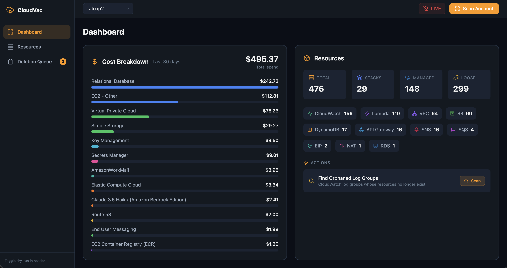

<p align="center">
  <h1 align="center">CloudVac</h1>
  <p align="center"><strong>Good housekeeping for AWS.</strong></p>
  <p align="center">Scan, inspect, and clean up unused resources across multiple AWS profiles and regions.</p>
</p>

<p align="center">
  <a href="https://github.com/realadeel/CloudVac/actions/workflows/ci.yml"></a>
  <a href="https://opensource.org/licenses/MIT"></a>
  <a href="https://www.typescriptlang.org/"></a>
  <a href="https://nodejs.org/"></a>
  <a href="https://github.com/realadeel/CloudVac/pulls"></a>
</p>

<br>

<p align="center">
  
</p>

---

CloudVac reads your local `~/.aws/credentials`, scans 14 services across 4 US regions, identifies CloudFormation-managed vs. orphaned resources, estimates per-resource costs, and handles dependency-aware deletion with dry-run safety.

Everything runs locally. No telemetry. No external calls. Your credentials never leave your machine.

## Quick Start

### Prerequisites

- **Node.js 18+**
- **AWS credentials** configured in `~/.aws/credentials` and/or `~/.aws/config`

### Install and run

```bash
git clone https://github.com/realadeel/CloudVac.git
cd CloudVac
npm install
npm run dev
```

Opens at [http://localhost:5173](http://localhost:5173). Select a profile from the dropdown and click **Scan Account**.

### Run tests

```bash
npm test              # run all tests
npm run test:watch    # watch mode
npm run test:coverage # with coverage report
```

---

## Table of Contents

- [How It Works](#how-it-works)
- [Security Model](#security-model)
- [Exactly What It Touches](#exactly-what-it-touches)
- [IAM Permissions Reference](#iam-permissions-reference)
- [Services Scanned](#services-scanned)
- [Deletion Safety](#deletion-safety)
- [Deletion Ordering](#deletion-ordering)
- [Cost Estimation](#cost-estimation)
- [S3 Features](#s3-features)
- [Caching](#caching)
- [Architecture](#architecture)
- [API Reference](#api-reference)
- [Tech Stack](#tech-stack)
- [Contributing](#contributing)
- [License](#license)

---

## How It Works

CloudVac is a local-only tool. It runs two processes on your machine:

1. **Express API server** (port 3001) — talks to AWS using your local credentials
2. **Vite dev server** (port 5173) — serves the React UI, proxies `/api` to the Express server

When you click **Scan Account**, the server reads the selected profile from `~/.aws/credentials`, creates AWS SDK v3 clients, and makes read-only API calls to discover resources. Results stream back to the browser in real time via Server-Sent Events.

When you select resources for deletion, the server builds a dependency graph, shows you a full execution plan, and (only if you explicitly switch off dry-run and confirm) executes deletions in topological order.

Scan results and cost data are cached in a local SQLite database at `~/.cloudvac/cache.db` so you can switch profiles instantly without re-scanning.

---

## Security Model

> This section exists because you should be skeptical of any tool that asks for AWS access.

### Your credentials never leave your machine

- CloudVac reads `~/.aws/credentials` and `~/.aws/config` directly using the `ini` parser. It extracts `aws_access_key_id`, `aws_secret_access_key`, and optionally `aws_session_token` for server-side use only.
- The `/api/profiles` endpoint returns **only** `{ name, region }` per profile. Access keys are never sent to the browser.
- There is no telemetry, analytics, crash reporting, or external API calls of any kind. The only outbound HTTPS connections are to `*.amazonaws.com` via the AWS SDK.

### The client never talks to AWS

The React app only makes requests to `/api` (relative path), which Vite proxies to `localhost:3001`. The browser never has access to your AWS credentials.

### CORS is locked to localhost

The Express server sets `cors({ origin: 'http://localhost:5173' })`. Only the local Vite dev server can make cross-origin requests to the API.

### No authentication on the local API

The Express server binds to port 3001 without authentication. This is intentional for a localhost development tool, but it means any process on your machine can reach the API. If you're on a shared network, ensure port 3001 is firewalled.

### What's stored on disk

`~/.cloudvac/cache.db` (SQLite) contains:
- Cached scan results: resource IDs, names, regions, metadata, stack associations
- Cached cost data: 30-day spend by service
- Cached S3 bucket stats: object counts and sizes

It does **not** contain AWS access keys, secret keys, or session tokens. The `.gitignore` excludes all `.db`, `.sqlite`, and `.env` files.

### Dry-run is on by default

The deletion API defaults to `dryRun: true`. You must explicitly toggle it off and confirm before any destructive action executes.

### No writes during scanning

Every API call during a scan is a Describe/List/Get operation. Scanning never modifies your AWS resources. The only write operations happen during explicit deletion or S3 bucket emptying, both of which require your manual initiation.

---

## Exactly What It Touches

### During scanning (read-only)

| AWS Service | API Calls Made | What's Collected |
|---|---|---|
| **EC2** | `DescribeInstances` | Instance ID, type, IPs, VPC, state, launch time, tags |
| **EBS** | `DescribeVolumes` | Volume ID, size, type, IOPS, attachments, tags |
| **NAT Gateway** | `DescribeNatGateways` | Gateway ID, VPC, subnet, public IP, state |
| **Elastic IP** | `DescribeAddresses` | Allocation ID, public IP, association, domain |
| **VPC** | `DescribeVpcs`, `DescribeSubnets`, `DescribeSecurityGroups`, `DescribeInternetGateways`, `DescribeRouteTables` | IDs, CIDRs, AZs, associations, tags |
| **RDS** | `DescribeDBInstances`, `DescribeDBClusters` | Instance/cluster ID, engine, class, storage, endpoint, status |
| **ELB** | `DescribeLoadBalancers` (v1 + v2) | Name/ARN, type, scheme, DNS, VPC, AZs, state |
| **Lambda** | `ListFunctions` | Function name, ARN, runtime, memory, timeout, code size |
| **S3** | `ListBuckets`, `GetBucketLocation` | Bucket name, region, creation date |
| **DynamoDB** | `ListTables`, `DescribeTable` | Table name, ARN, status, items, size, billing mode, GSIs |
| **CloudWatch** | `DescribeLogGroups`, `DescribeAlarms` | Log group names, stored bytes, retention; alarm names, metrics, state |
| **SNS** | `ListTopics`, `GetTopicAttributes` | Topic ARN, subscription counts, FIFO flag |
| **SQS** | `ListQueues`, `GetQueueAttributes` | Queue URL/ARN, message counts, visibility timeout, DLQ |
| **API Gateway** | `GetRestApis`, `GetApis` (v2) | API ID, name, type, endpoint, creation date |
| **CloudFormation** | `ListStacks`, `ListStackResources` | Stack ID/name, status, creation time, all child resource IDs |
| **Cost Explorer** | `GetCostAndUsage` | 30-day unblended cost grouped by service |

All scanning API calls are paginated where applicable. No data is modified.

### During S3 bucket inspection (read-only)

| Operation | API Call | Purpose |
|---|---|---|
| Bucket stats | `ListObjectsV2` (full enumeration) | Count all objects and sum their sizes |
| Object browsing | `ListObjectsV2` with `Delimiter='/'` | Folder-like navigation with pagination |

### During deletion (destructive)

These API calls are **only** made when you explicitly initiate deletion with dry-run disabled:

| Resource Type | API Calls | Notes |
|---|---|---|
| EC2 Instance | `TerminateInstances` | |
| EBS Volume | `DeleteVolume` | Fails if still attached |
| NAT Gateway | `DeleteNatGateway` | |
| Elastic IP | `ReleaseAddress` | |
| VPC | `DeleteVpc` | Must remove dependents first |
| Subnet | `DeleteSubnet` | |
| Security Group | `DeleteSecurityGroup` | Default SGs are blocked |
| Internet Gateway | `DetachInternetGateway` + `DeleteInternetGateway` | Detaches from VPC first |
| Route Table | `DeleteRouteTable` | |
| RDS Instance | `DeleteDBInstance` | `SkipFinalSnapshot: true` |
| RDS Cluster | `DeleteDBCluster` | `SkipFinalSnapshot: true` |
| ALB / NLB | `DeleteLoadBalancer` (v2) | |
| CLB | `DeleteLoadBalancer` (v1) | |
| Lambda Function | `DeleteFunction` | |
| S3 Bucket | `ListObjectVersions` + `DeleteObjects` (batched) + `DeleteBucket` | Empties all versions and delete markers first |
| DynamoDB Table | `DeleteTable` | |
| CloudWatch Log Group | `DeleteLogGroup` | |
| CloudWatch Alarm | `DeleteAlarms` | |
| SNS Topic | `DeleteTopic` | |
| SQS Queue | `DeleteQueue` | |
| REST API | `DeleteRestApi` | |
| HTTP API | `DeleteApi` (v2) | |
| CF Stack | `DescribeStackResources` + empties S3 buckets in stack + `DeleteStack` | Pre-empties S3 so CF deletion succeeds |

---

## IAM Permissions Reference

<details>
<summary><strong>Minimum for scanning only (read-only)</strong></summary>

```json
{
  "Version": "2012-10-17",
  "Statement": [
    {
      "Effect": "Allow",
      "Action": [
        "ec2:DescribeInstances",
        "ec2:DescribeVolumes",
        "ec2:DescribeNatGateways",
        "ec2:DescribeAddresses",
        "ec2:DescribeVpcs",
        "ec2:DescribeSubnets",
        "ec2:DescribeSecurityGroups",
        "ec2:DescribeInternetGateways",
        "ec2:DescribeRouteTables",
        "rds:DescribeDBInstances",
        "rds:DescribeDBClusters",
        "elasticloadbalancing:DescribeLoadBalancers",
        "lambda:ListFunctions",
        "s3:ListAllMyBuckets",
        "s3:GetBucketLocation",
        "s3:ListBucket",
        "dynamodb:ListTables",
        "dynamodb:DescribeTable",
        "logs:DescribeLogGroups",
        "cloudwatch:DescribeAlarms",
        "sns:ListTopics",
        "sns:GetTopicAttributes",
        "sqs:ListQueues",
        "sqs:GetQueueAttributes",
        "apigateway:GET",
        "cloudformation:ListStacks",
        "cloudformation:ListStackResources",
        "ce:GetCostAndUsage"
      ],
      "Resource": "*"
    }
  ]
}
```

</details>

<details>
<summary><strong>Additional permissions for deletion</strong></summary>

```json
{
  "Version": "2012-10-17",
  "Statement": [
    {
      "Effect": "Allow",
      "Action": [
        "ec2:TerminateInstances",
        "ec2:DeleteVolume",
        "ec2:DeleteNatGateway",
        "ec2:ReleaseAddress",
        "ec2:DeleteVpc",
        "ec2:DeleteSubnet",
        "ec2:DeleteSecurityGroup",
        "ec2:DetachInternetGateway",
        "ec2:DeleteInternetGateway",
        "ec2:DeleteRouteTable",
        "rds:DeleteDBInstance",
        "rds:DeleteDBCluster",
        "elasticloadbalancing:DeleteLoadBalancer",
        "lambda:DeleteFunction",
        "s3:ListBucketVersions",
        "s3:DeleteObject",
        "s3:DeleteBucket",
        "dynamodb:DeleteTable",
        "logs:DeleteLogGroup",
        "cloudwatch:DeleteAlarms",
        "sns:DeleteTopic",
        "sqs:DeleteQueue",
        "apigateway:DELETE",
        "cloudformation:DescribeStackResources",
        "cloudformation:DeleteStack"
      ],
      "Resource": "*"
    }
  ]
}
```

</details>

You can scope `Resource` to specific ARNs or use conditions to restrict which accounts/regions are affected.

---

## Services Scanned

14 services across 4 US regions (`us-east-1`, `us-east-2`, `us-west-1`, `us-west-2`):

| Service | Resources Found |
|---|---|
| **EC2** | All non-terminated instances |
| **RDS** | DB instances and Aurora clusters |
| **ELB** | Application, Network, and Classic Load Balancers |
| **EBS** | All volumes (flags unattached ones) |
| **NAT Gateway** | All non-deleted gateways |
| **Elastic IP** | All allocations (flags unassociated ones) |
| **Lambda** | All functions with runtime, memory, code size |
| **S3** | Buckets in target regions with on-demand size/object counts |
| **DynamoDB** | All tables with throughput, billing mode, item counts |
| **VPC** | VPCs, subnets, security groups, internet gateways, route tables |
| **CloudWatch** | Log groups with retention and stored bytes; metric alarms |
| **SNS** | Topics with subscription counts |
| **SQS** | Queues with message counts and DLQ configuration |
| **API Gateway** | REST APIs and HTTP/WebSocket APIs |
| **CloudFormation** | Active stacks and all child resources (used to tag managed resources) |

Regions are configured in `server/src/config.ts`. Add or remove entries from the `REGIONS` array to change coverage.

---

## Deletion Safety

CloudVac is designed to make it hard to accidentally destroy things:

- **Dry-run is the default.** You see the full execution plan before anything happens.
- **Dependency validation.** The deletion planner checks for issues and surfaces warnings and hard errors before execution.
- **Default security groups are blocked.** Attempting to delete a default SG produces an error that halts the plan.
- **Explicit warnings for destructive operations:**
  - S3 buckets: "All objects will be permanently deleted"
  - RDS instances/clusters: "Will be deleted without a final snapshot"
  - DynamoDB tables: "All data will be permanently deleted"
  - VPCs: "Requires all dependent resources to be removed first"
  - EBS volumes: "Volume is still attached to an instance not in the deletion set"
- **Managed resource deduplication.** If a resource belongs to a CloudFormation stack that's also being deleted, the individual resource is skipped (CloudFormation handles it).
- **Real-time progress.** Deletion progress streams back via SSE so you can see exactly what's happening.

---

## Deletion Ordering

Resources are deleted in dependency order using a topological sort:

```
Tier 0  CloudFormation stacks (CF handles internal ordering)
Tier 1  EC2 instances, NAT Gateways, Load Balancers, RDS instances/clusters
Tier 2  Lambda, DynamoDB, SNS, SQS, API Gateway, CloudWatch alarms
Tier 3  EBS volumes, Elastic IPs, CloudWatch log groups
Tier 4  Subnets, Route Tables, Internet Gateways, Security Groups
Tier 5  S3 buckets (emptied first, then deleted)
Tier 6  VPCs (only after all dependents are gone)
```

Tiers execute sequentially. Within each tier, up to 3 deletions run in parallel. Additional dependency edges are computed for specific cases (e.g., EBS volumes attached to EC2 instances, Elastic IPs used by NAT Gateways, VPC sub-resources).

---

## Cost Estimation

CloudVac provides per-resource monthly cost estimates using static on-demand pricing data:

| Resource | Estimation Method |
|---|---|
| **EC2** | Instance type hourly rate x 730 hrs/mo |
| **EBS** | Per-GB rate + provisioned IOPS/throughput charges |
| **RDS** | Instance class hourly rate + storage (multi-AZ doubles compute) |
| **NAT Gateway** | Hourly rate x 730 hrs/mo |
| **Elastic IP** | Charged when unassociated, free when associated |
| **ELB** | Base hourly rate x 730 hrs/mo |
| **DynamoDB** | Provisioned RCU/WCU + storage (on-demand returns N/A) |
| **CloudWatch** | Log storage per GB + $0.10/alarm/mo |
| **S3** | Storage per GB (requires bucket stats) |
| **Lambda, SNS, SQS, API Gateway** | $0 when idle (usage-based, no idle cost) |
| **VPC, Subnet, SG, IGW, Route Table** | Free |
| **CF Stacks** | N/A (cost is in child resources) |

When you queue resources for deletion, the **savings banner** shows your current bill, estimated monthly savings, and projected bill after cleanup. Regional multipliers are applied for `us-west-1` (10% premium).

---

## S3 Features

**On-demand bucket sizing** — Click the hard drive icon on any S3 bucket to compute total object count and size. Results are cached in SQLite and load instantly on subsequent visits.

**Object browser** — Click the folder icon to open a folder-like browser at `/s3/:bucketName` using S3's `Delimiter='/'` and `Prefix` parameters with pagination (200 objects per page).

**Bucket emptying** — Iterates `ListObjectVersions` and `DeleteObjects` in batches of 1000, handling all versions and delete markers. Progress streams via SSE.

**Cache invalidation** — Bucket stats are cleared on delete, set to 0/0 on empty, and cleared for a profile on cache reset.

---

## Caching

Scan results, cost data, and bucket stats are cached in SQLite at `~/.cloudvac/cache.db`:

| Table | What's Cached | Invalidation |
|---|---|---|
| `scan_results` | Full resource list + CF stacks | Overwritten on re-scan |
| `cost_results` | 30-day cost breakdown | `?refresh=true` to force |
| `bucket_stats` | Object count + total size per bucket | On delete, on empty, on profile clear |

Benefits:
- **Instant profile switching** without re-scanning
- **Persistent across restarts** so you don't lose scan data
- **Avoids repeat Cost Explorer charges** ($0.01 per API call)
- **SQLite WAL mode** for concurrent read performance

---

## Architecture

```
cloudvac/
├── shared/              TypeScript types shared across packages
│   └── types.ts         Resource, CFStack, CostSummary, event types
│
├── server/              Express 5 API server
│   └── src/
│       ├── index.ts           App setup, CORS, route registration
│       ├── config.ts          Regions, services, concurrency, port
│       ├── routes/            REST + SSE endpoints
│       ├── aws/
│       │   ├── credentials.ts  Reads ~/.aws/credentials + config
│       │   ├── clients.ts      AWS SDK v3 client factory (cached)
│       │   ├── cost-explorer.ts Cost Explorer integration
│       │   ├── cloudformation.ts Stack + resource discovery
│       │   └── scanners/        14 service-specific scanners
│       ├── pricing/           Static cost estimation engine
│       ├── db/                SQLite schema, queries, caching
│       ├── deletion/          Dependency graph, executor, 24 strategies
│       └── sse/               SSE response helper
│
├── client/              React 19 + Vite 6 + Tailwind CSS 4
│   └── src/
│       ├── stores/            Zustand v5 stores (6 stores)
│       ├── hooks/             SSE lifecycle hooks
│       ├── pages/             5 pages (Dashboard, Resources, S3, Deletion, Logs)
│       ├── components/        UI components (layout, dashboard, resources, deletion, s3, shared)
│       └── lib/               Utilities (format, cn)
│
└── .github/workflows/   CI pipeline (test, build, type check)
```

---

## API Reference

| Endpoint | Method | Description |
|---|---|---|
| `/api/health` | GET | Health check |
| `/api/profiles` | GET | List AWS profiles (names + regions only, no credentials) |
| `/api/scan?profile=X` | GET | SSE stream: scans 14 services across 4 regions |
| `/api/resources?profile=X` | GET | Cached scan results with optional filters |
| `/api/resources/:id?profile=X` | GET | Single resource by ID |
| `/api/costs?profile=X` | GET | 30-day cost breakdown (cached; `&refresh=true` to force) |
| `/api/costs/estimates?profile=X` | GET | Per-resource monthly cost estimates |
| `/api/delete` | POST | Start deletion job (`{ profile, resourceIds, dryRun }`) |
| `/api/delete/:jobId` | GET | SSE stream: deletion progress with event replay |
| `/api/s3/stats/all?profile=X` | GET | All cached bucket stats for a profile |
| `/api/s3/:bucket/stats?profile=X` | GET | Compute bucket size/count (cached) |
| `/api/s3/:bucket/objects?profile=X` | GET | Paginated object listing with folder navigation |
| `/api/empty-bucket` | POST | SSE stream: empties an S3 bucket |

---

## Tech Stack

| Layer | Technology |
|---|---|
| **Server** | Express 5, AWS SDK v3, better-sqlite3, tsx |
| **Client** | React 19, Vite 6, Tailwind CSS 4, Zustand 5 |
| **Testing** | Vitest, v8 coverage |
| **CI** | GitHub Actions (Node 18/20/22 matrix) |
| **Fonts** | Geist Sans + Geist Mono |
| **Icons** | Lucide React |
| **Routing** | React Router 7 |
| **Monorepo** | npm workspaces |
| **Language** | TypeScript 5.7 throughout |

---

## Contributing

Contributions are welcome! Please open an issue first to discuss what you'd like to change.

### Adding a new AWS service

Each scanner is a self-contained module:

1. Create `server/src/aws/scanners/yourservice.ts` exporting a scan function
2. Add a client factory in `server/src/aws/clients.ts`
3. Register it in `server/src/aws/scanners/index.ts` scanner map
4. Add a deletion strategy in `server/src/deletion/strategies/yourservice.ts`
5. Add a priority tier in `server/src/deletion/dependency-graph.ts`
6. Add the service + resource types to `shared/types.ts` and `server/src/config.ts`
7. Add icon + color in `client/src/components/shared/ServiceIcon.tsx` and `client/src/index.css`
8. Add a display label in `client/src/lib/format.ts` (`RESOURCE_TYPE_LABELS`)
9. Add pricing data in `server/src/pricing/rates.ts` and estimation logic in `estimate.ts`
10. Add tests

### Development

```bash
npm run dev            # Start server + client concurrently
npm test               # Run all tests
npm run test:coverage  # Tests with coverage report
npm run build          # Production build
```

---

## License

[MIT](LICENSE)
